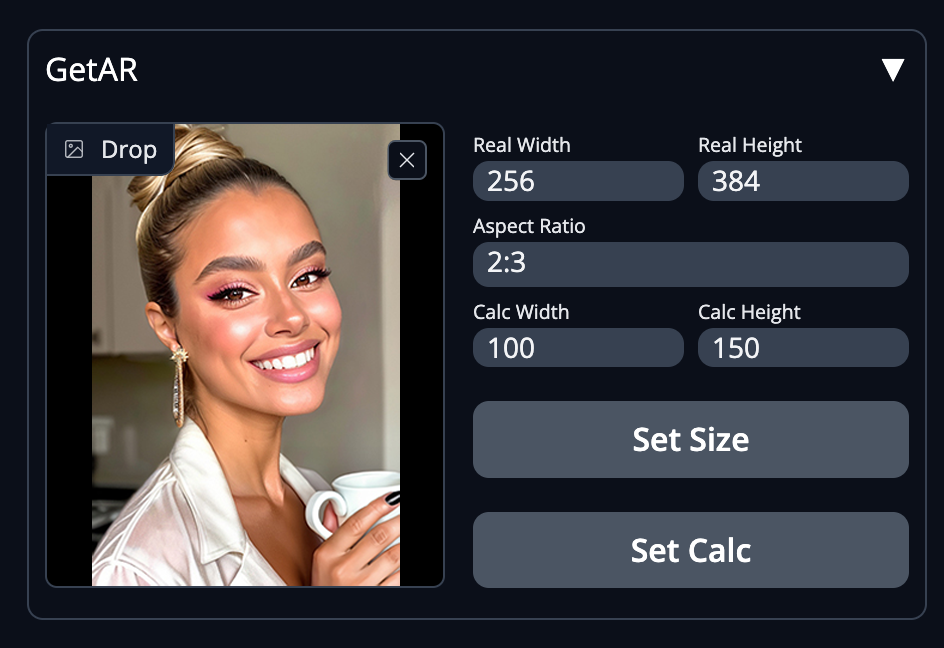

# GetAR - A Stable Diffusion Automatic1111 Extension

## Overview
GetAR is an intuitive extension for the popular Stable Diffusion system, designed to simplify the process of managing image dimensions and aspect ratios. With a user-friendly interface, users can seamlessly upload images and have the dimensions automatically set, or calculate dimensions while maintaining the aspect ratio for further use in the image generation process.

## Features
- **Easy Image Upload**: Drag and drop functionality for quick image uploads.
- **Automatic Dimension Setting**: On image upload, `Real Width` and `Real Height` are automatically populated with the image's dimensions.
- **Dimension Calculation**: Input a width to calculate the height maintaining the aspect ratio, or vice versa, for precise dimension management.
- **Seamless Integration**: Set Size and Set Calc buttons transfer the real or calculated dimensions directly to the image generation sliders, streamlining the workflow.

## Extension Preview

## Installation
To install the GetAR extension, follow these steps:
1. Download the latest version of the extension from the repository.
2. Unpack the downloaded file into your Stable Diffusion directory.
3. Restart the Stable Diffusion interface to automatically load the extension.

## Usage
Upon installing the GetAR extension, you will see a new control block in the Stable Diffusion interface. To use the extension:
1. Drag and drop an image into the 'Drop' area to automatically populate `Real Width` and `Real Height`.
2. Use 'Set Size' to apply these dimensions to the image generation sliders.
3. Alternatively, enter a width or height in the calculation fields to get the corresponding dimension based on the aspect ratio.
4. Click 'Set Calc' to transfer the calculated dimensions to the image generation sliders.

## Support
If you encounter any issues or have questions while using the GetAR extension, please create an issue in the project's GitHub repository.

## License
GetAR is distributed under the MIT License, allowing for use, modification, and distribution in compliance with the license terms.

Enjoy enhancing your Stable Diffusion experience with GetAR!
